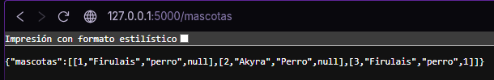
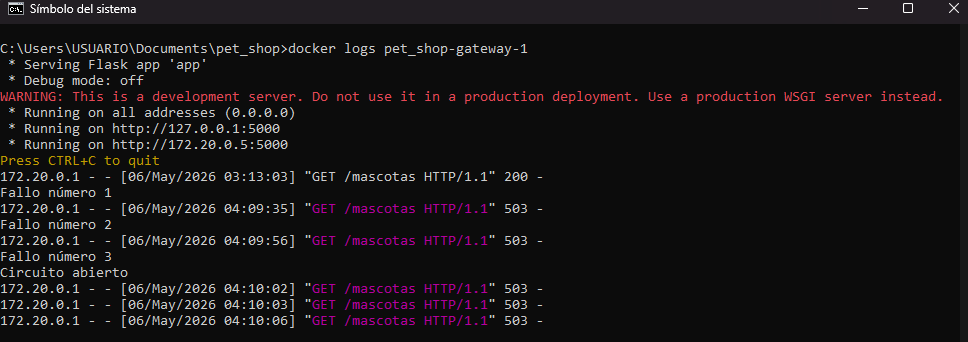
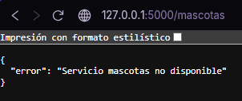
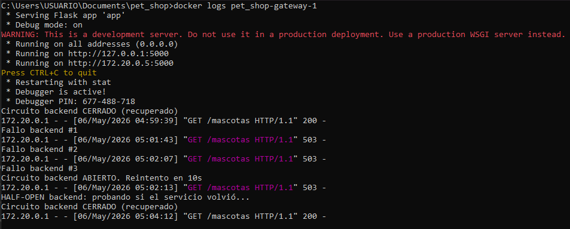
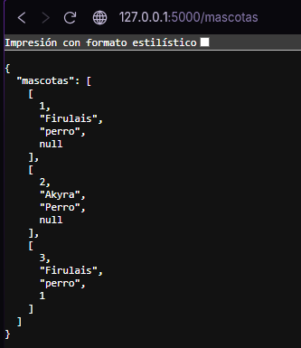
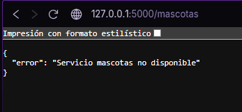
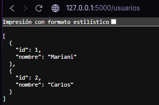
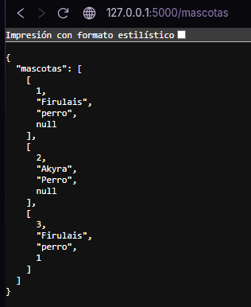
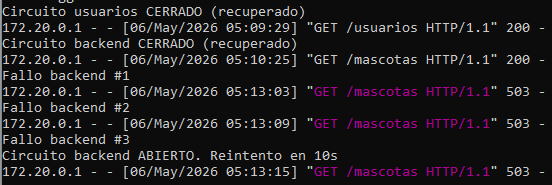
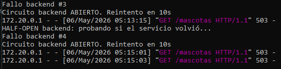

# Laboratorio: Sistema que aprende a fallar
**Stefania Collazos**

---

## Fase 1 - Observar

**Explicación:** Apagué el servicio de backend con `docker-compose stop backend` y realicé varias peticiones al gateway en `/mascotas`. Observé que el sistema no tenía ninguna protección: cada petición intentaba conectarse al backend, esperaba 2 segundos hasta que vencía el timeout, contaba un fallo, y al llegar al tercer fallo abría el circuito. Una vez abierto, respondía con error 503 instantáneo pero nunca intentaba recuperarse solo. El servicio quedaba bloqueado para siempre hasta reiniciar el gateway.

**¿Qué hace el sistema actualmente?**
Cuando el backend está apagado, el gateway intenta conectarse y falla. Cada vez que falla, suma un contador interno. Cuando llega a 3 fallos, marca el circuito como "abierto" y deja de intentarlo. Después del tercer fallo, responde directo con un error 503 sin siquiera intentar conectarse al backend.

**¿Se protege o insiste?**
Insiste durante los primeros 3 intentos (sin protección). Después del tercero, se protege y ya no vuelve a intentar la conexión hasta que alguien reinicie el gateway. El problema es que nunca se recupera solo: si el backend vuelve, el gateway sigue bloqueado para siempre.

**Evidencia**

Sistema funcionando:


LOGS


---

## Fase 2 - Aplicar

**Explicación:** Reorganicé la lógica del circuit breaker usando un diccionario llamado `circuitos` y tres funciones reutilizables: `verificar_circuito`, `registrar_exito` y `registrar_fallo`. Apliqué esta lógica tanto en `/mascotas` como en `/usuarios`, cada uno con su propio circuito independiente. Observé que al apagar el backend, el circuito de mascotas se abría pero `/usuarios` seguía respondiendo con normalidad, demostrando que los fallos de un servicio no afectan al otro.

**¿Cada servicio debe tener su propio contador de fallos?**
Sí. Si el backend falla no tiene sentido bloquear el servicio de usuarios. Son contadores separados porque son servicios distintos.

**¿El circuito debe abrirse de forma independiente por servicio?**
Sí. Si `/mascotas` cae, `/usuarios` debe seguir funcionando normal. Un circuito por servicio da más resiliencia al sistema.

**¿Qué pasa si falla un servicio pero el otro sigue funcionando?**
El sistema responde parcialmente: `/usuarios` devuelve datos normales mientras `/mascotas` devuelve error 503. El usuario tiene información parcial, pero el sistema no se cae entero.

**Evidencia**



LOGS


**Código implementado:**

```python
from flask import Flask, jsonify
import requests

app = Flask(__name__)

Limite_fallos = 3

# Estado de cada circuito
circuitos = {
    "backend":  {"fallos": 0, "abierto": False},
    "usuarios": {"fallos": 0, "abierto": False},
}

def verificar_circuito(nombre):
    return not circuitos[nombre]["abierto"]

def registrar_exito(nombre):
    circuitos[nombre]["fallos"]  = 0
    circuitos[nombre]["abierto"] = False
    print(f"Circuito {nombre} CERRADO", flush=True)

def registrar_fallo(nombre):
    circuitos[nombre]["fallos"] += 1
    print(f"Fallo {nombre} #{circuitos[nombre]['fallos']}", flush=True)
    if circuitos[nombre]["fallos"] >= Limite_fallos:
        circuitos[nombre]["abierto"] = True
        print(f"Circuito {nombre} ABIERTO", flush=True)


@app.route("/mascotas")
def mascotas():
    if not verificar_circuito("backend"):
        return jsonify({"error": "Servicio mascotas bloqueado"}), 503
    try:
        r = requests.get("http://backend:5000/mascotas", timeout=2)
        registrar_exito("backend")
        return jsonify(r.json())
    except:
        registrar_fallo("backend")
        return jsonify({"error": "Servicio mascotas no disponible"}), 503


@app.route("/usuarios")
def usuarios():
    if not verificar_circuito("usuarios"):
        return jsonify({"error": "Servicio usuarios bloqueado"}), 503
    try:
        r = requests.get("http://usuarios:5000/usuarios", timeout=2)
        registrar_exito("usuarios")
        return jsonify(r.json())
    except:
        registrar_fallo("usuarios")
        return jsonify({"error": "Servicio usuarios no disponible"}), 503


if __name__ == "__main__":
    app.run(host="0.0.0.0", port=5000, debug=True)
```

---

## Fase 3 - Investigar

**Explicación:** Investigué el estado half-open del circuit breaker. Aprendí que es un estado intermedio entre abierto y cerrado: después de un tiempo de espera definido, el circuito deja pasar una sola petición de prueba para verificar si el servicio se recuperó. Si esa petición tiene éxito, el circuito se cierra. Si falla, vuelve a abrirse y reinicia el temporizador.

**¿Qué significa "half-open"?**
Es un tercer estado del Circuit Breaker, entre abierto (bloqueado) y cerrado (funcionando). Imagínalo como abrir la puerta a medias: el sistema deja pasar una sola petición de prueba para ver si el servicio caído ya se recuperó, sin abrirle paso a todo el tráfico todavía.

**¿Cuándo se vuelve a intentar una llamada?**
Después de que pasa un tiempo de espera definido (10 segundos). Cuando ese tiempo se cumple, el circuito pasa de abierto a half-open y deja pasar la próxima petición como prueba.

**¿Qué pasa si el servicio vuelve a fallar?**
El circuito vuelve a abrirse completamente y reinicia el temporizador. Si la prueba tiene éxito, el circuito se cierra y el sistema vuelve a funcionar normal con todas las peticiones.

**Diagrama de estados:**
```
CERRADO    →  (3 fallos)       →  ABIERTO
ABIERTO    →  (pasan 10 seg)   →  HALF-OPEN
HALF-OPEN  →  (prueba OK)      →  CERRADO
HALF-OPEN  →  (prueba falla)   →  ABIERTO
```

**Evidencia**



---

## Fase 4 - Implementar

**Explicación:** Agregué el campo `"desde"` al diccionario de cada circuito para guardar el momento exacto en que se abrió. En la función `verificar_circuito` añadí la comparación `time.time() - c["desde"] >= ESPERA_SEGUNDOS`: si pasaron 10 segundos, el circuito entra en half-open y deja pasar una petición de prueba. Observé en los logs el mensaje `HALF-OPEN` seguido de `CERRADO (recuperado)` cuando el servicio volvía, confirmando que la recuperación automática funcionaba correctamente.

**Evidencia**

Servicio backend funcionando


Petición 1,2 y 3 con servicio backend apagado


Esperamos 10seg y levantamos backend nuevamente

LOGS


**Código implementado:**

```python
from flask import Flask, jsonify
import requests
import time

app = Flask(__name__)

Limite_fallos   = 3
Espera_segundos = 10

# Estado de cada circuito (ahora incluye "desde" para el half-open)
circuitos = {
    "backend":  {"fallos": 0, "abierto": False, "desde": None},
    "usuarios": {"fallos": 0, "abierto": False, "desde": None},
}

def verificar_circuito(nombre):
    c = circuitos[nombre]
    if not c["abierto"]:
        return True

    if time.time() - c["desde"] >= ESPERA_SEGUNDOS:
        print(f"HALF-OPEN {nombre}: probando si el servicio volvió...", flush=True)
        return True
    return False

def registrar_exito(nombre):
    c = circuitos[nombre]
    c["fallos"]  = 0
    c["abierto"] = False
    c["desde"]   = None
    print(f"Circuito {nombre} CERRADO (recuperado)", flush=True)

def registrar_fallo(nombre):
    c = circuitos[nombre]
    c["fallos"] += 1
    print(f"Fallo {nombre} #{c['fallos']}", flush=True)
    if c["fallos"] >= Limite_fallos:
        c["abierto"] = True
        c["desde"]   = time.time()
        print(f"Circuito {nombre} ABIERTO. Reintento en {Espera_segundos}s", flush=True)


@app.route("/mascotas")
def mascotas():
    if not verificar_circuito("backend"):
        return jsonify({"error": "Servicio mascotas bloqueado"}), 503
    try:
        r = requests.get("http://backend:5000/mascotas", timeout=2)
        registrar_exito("backend")
        return jsonify(r.json())
    except:
        registrar_fallo("backend")
        return jsonify({"error": "Servicio mascotas no disponible"}), 503


@app.route("/usuarios")
def usuarios():
    if not verificar_circuito("usuarios"):
        return jsonify({"error": "Servicio usuarios bloqueado"}), 503
    try:
        r = requests.get("http://usuarios:5000/usuarios", timeout=2)
        registrar_exito("usuarios")
        return jsonify(r.json())
    except:
        registrar_fallo("usuarios")
        return jsonify({"error": "Servicio usuarios no disponible"}), 503


if __name__ == "__main__":
    app.run(host="0.0.0.0", port=5000, debug=True)
```

---

## Fase 5 - Validar

**Explicación:** Probé el sistema en los cuatro escenarios. Con todos los servicios activos, las peticiones respondían con normalidad y los circuitos se mantenían cerrados. Al apagar el backend, los logs mostraron los fallos acumulándose hasta que el circuito se abrió. Con el circuito abierto, las respuestas de error llegaban instantáneamente sin esperar timeout. Finalmente, al volver a levantar el backend y esperar 10 segundos, el circuito entró en half-open, la petición de prueba fue exitosa y el sistema se recuperó solo sin necesidad de reiniciar nada.

**Evidencia**
**1. Servicios funcionando**

servicio usuarios funcionando


servicio mascotas funcionando



**2. Servicio caído**

Apagando el servicio backend
LOGS




**3.Circuito abierto**

LOGS


---

## Análisis final

**¿Qué cambió en el comportamiento del sistema?**
Antes el gateway solo tenía un circuito para `/mascotas` y cuando se abría, quedaba bloqueado para siempre hasta reiniciar el servidor. Ahora cada servicio tiene su propio circuito independiente, entonces si el backend cae, `/usuarios` sigue funcionando normal. Además el sistema se recupera solo: después de 10 segundos entra en half-open, prueba si el servicio volvió y cierra el circuito automáticamente si funciona.

**¿Qué decisiones tomé en la implementación?**
Decidí guardar el estado de cada circuito en un diccionario llamado `circuitos` en vez de tener variables sueltas por servicio. Eso permitió crear tres funciones reutilizables (`verificar_circuito`, `registrar_exito`, `registrar_fallo`) que cada endpoint usa, sin repetir la lógica. Elegí 10 segundos como tiempo de espera para el half-open y 3 fallos como límite para abrir el circuito.

**¿Qué dificultades encontré?**
La parte más difícil fue implementar el half-open correctamente. Al principio no era claro cómo distinguir si el circuito estaba abierto por primera vez o si ya había pasado el tiempo de espera. La solución fue guardar el momento exacto en que se abrió el circuito (`"desde": time.time()`) y compararlo con el tiempo actual en cada petición.